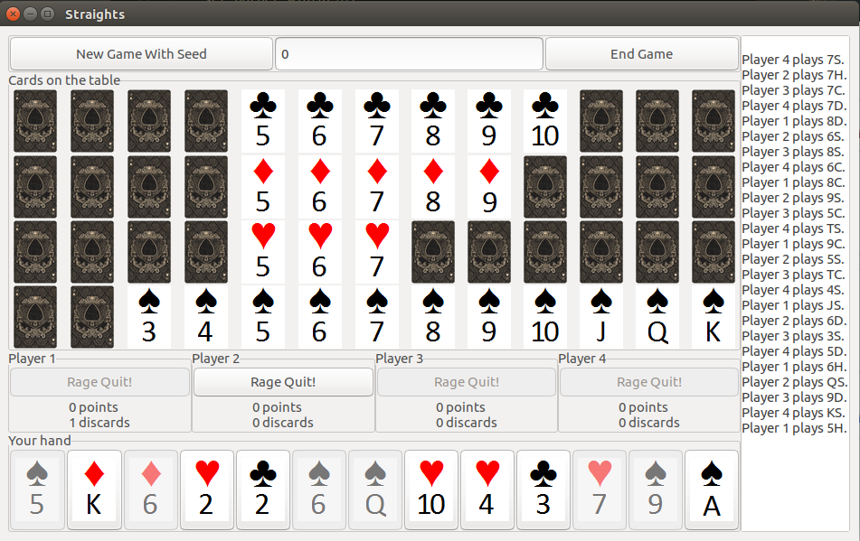

## AI For Software Engineering
---
### ETW Trace Bottleneck Detection and Patch Generation using Transformers (Ongoing)

Finetuning BART. Pattern Based Bottleneck. NDA.

 

---

### PerfLens: A Data-Driven Performance Bug Detection and Fix Platform

PerfLens is a data-driven approach to software performance improvement in C#. We first compile a large dataset of hundreds of performance improvements made in open source
projects. We then leverage this data to build a tool called PerfLens for performance improvement recommendations via code search. PerfLens indexes the performance improvements, takes a codebase as an input and searches a pool of performance improvements for similar code. We show that
when our system is further augmented with profiler data information our recommendations are more accurate. Our
experiments show that PerfLens can suggest performance improvements with 90% accuracy when profiler data is available and 55% accuracy when it analyzes source code only.

---
### Genie: Human Language to Azure CLI Snippets

Genie.

---
### Aladdin: Artificial Example Generation for Azure CLI

Aladdin is an AI tool to automate the creation of usage examples for reference docs of command line
tools like Azure-CLI, Powershell and Azure SDKs. It makes use of product telemetry, documentation and to generate examples for the most popular commands and parameter sets. For Azure-CLI, Aladdin is able to provide coverage for 99% of the commands as opposed to the current in-product coverage of 49%
provided by human written examples.

 

 

---
## Side-Projects

### Voxels Game Engine

Game engine written in C++ using OpenGL.

 

 

---
### 4Kb Demo Scenes

Ray-March demos using C++, GLSL and OpenGL.

 

 

---
### Straights Card Game

A simple card game written in C++ using gtkmm and GStreamer.

 

 

---
## Sketching

Outside of work, I also have a great passion for sketching. Below are.

 

 

---

© 2021 Spandan Garg. Powered by Jekyll and the Minimal Theme.

