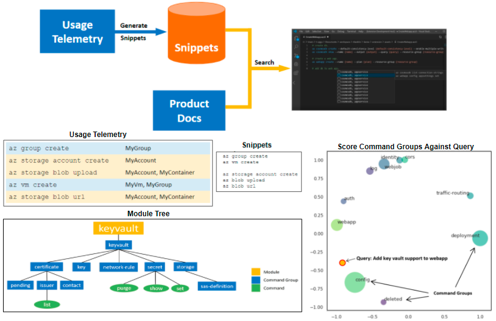

# <b>Portfolio</b>

## <b><i>Patents and Publications</i></b>
---
<u>Spandan Garg</u>, Paul Harrington, Roshanak Zilouchian Moghaddam, Chen Wu and Neel Sundaresan. 2021. System and Method For Identifying Performance Bottlenecks. Filed November 12th., 2021. Patent Pending.

<u>Spandan Garg</u>, Roshanak Zilouchian Moghaddam, Chen Wu, and Neel Sundaresan. 2021. PerfLens: A Data-driven Performance Bug Detection and Fix Platform. In <i>Proceedings of the 10th ACM SIGPLAN International Workshop on the State of the Art in Program Analysis (SOAP’2021)</i>.

<u>Spandan Garg</u>, Paul Harrington, Roshanak Zilouchian Moghaddam, and Chen Wu. 2021. Performance Bug Detection and Code Recommendation. Filed March 10th., 2021. Patent Pending.

<u>Spandan Garg</u>, Roshanak Zilouchian Moghaddam, Yevhen Mohylevskyy and Jason Shaver. 2019. Command-line Script Generation with Relevance Search. U.S. Patent Application 20210342357, Filed May 1st., 2020. Patent Pending.

<u>Spandan Garg</u>, <u>Roshanak Zilouchian Moghaddam</u>, Jason Shaver and Neel Sundaresan. 2019. Machine Generated Examples of Command-line Commands with Parameter Values. U.S. Patent Application 20210342654, Filed April 29th., 2020. Patent Pending.
 

## <i><b>AI For Software Engineering</b></i>
---
### <b>Performance Bottleneck Detection and Patch Generation using Transformers</b> (Ongoing)

<b>Bottleneck detection in ETW Traces</b>: Developed a bottleneck detection approach for .NET applications by identifying
patterns of function calls corresponding to known performance issues among call-stacks in profiler traces. This has been integrated into the Azure Application Insights Profiler and was also demoed at VSLive! Conference (2021) keynote. <a href="https://github.com/microsoft/optimization-insights">Sign up</a> for our private preview!
 
<b>Patch Generation</b>: Finetuned Facebook's BART model to generate patches to fix performance issues. Further details cannot be disclosed due to NDA.

 

---

### <b>PerfLens: A Data-Driven Performance Bug Detection and Fix Platform</b>

PerfLens is a data-driven approach to software performance improvement in C#. We first compile a large dataset of hundreds of performance improvements made in open source projects. We then leverage this data to build a tool called PerfLens for performance improvement recommendations via code search. PerfLens indexes the performance improvements, takes a codebase as an input and searches a pool of performance improvements for similar code. We show that when our system is further augmented with profiler data information our recommendations are more accurate. Our experiments show that PerfLens can suggest performance improvements with 90% accuracy when profiler data is available and 55% accuracy when it analyzes source code only.

---
### <b>Genie: Human Language to Azure CLI Snippets</b>

 Genie is a AI tool that translates human language queries to snippets of Azure CLI commands. We first create an index of common snippets by splitting the telemetry into usage sessions and mining frequent sequences of successful commands. Given a human language query, we use FastText word embeddings and Azure documentation to resolve out of vocab (OoV) words, fix typos, perform query expansion, etc. We then leverage the hierarchical nature of CLI modules to score the query against the different modules, command groups and commands in CLI and produce a ranked list of snippets based on the aggregated scores of their component commands. This approach was demoed at the Microsoft Azure+AI Conference (2019).

VS Code Extension Demo:

---
### <b>Aladdin: Artificial Example Generation for Azure CLI</b>

Aladdin is an AI framework to automate the creation of usage examples for reference docs of command line tools like Azure-CLI, Powershell and Azure SDKs. We leverage the product telemetry to get the most popular parameter sets for commands that are missing examples and use a Random Forest model (trained on Azure documentation) to select parameter values that reflect the underlying type (IP Address, File path, GUID, etc.) of a parameter during example generation. For Azure-CLI, Aladdin is able to provide coverage for 99% of the commands as opposed to the current in-product coverage of 46% provided by human written examples.

 

 

## <b><i>Hobbies & Side-Projects</i></b>
---
### <b>Voxels Game Engine</b>

A game engine I wrote from scratch using C++ and OpenGL.

 

 

---
### <b>4Kb Demo Scenes</b>

Ray-Marching demos I wrote using C++, OpenGL and GLSL.

 

 

---
### <b>Straights Card Game</b>

A card game written in C++ using gtkmm for the GUI and GStreamer for the background music.

 

 

---
### <b>Overworld 2D RPG Game Engine</b>

A 2D game engine written using javascript and HTML.

 

 

---
### <b>Sketching</b>

Outside of work, I also have a great passion for art, particularly sketching. Below are a few of my sketches that I felt turned out well. Please visit my Tumblr to view my other works! :)

 

 

---

© 2021 Spandan Garg. Powered by Jekyll and the Minimal Theme.

