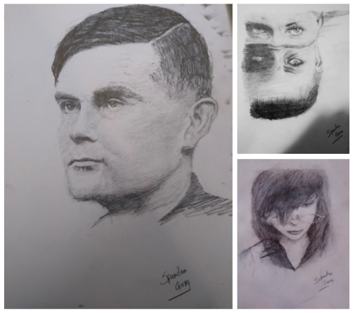

# <b>Portfolio</b>
## <b><i>Updates</i></b>
Feb 10, 2022:
 Aladdin Azure CLI work submitted to <b>KDD'22</b> Applied Science Track!
"<b>Generating Examples For CLI Usage - Can Transformers Help?</b>" (<a href="https://github.com/glGarg/glgarg.github.io/blob/main/pdf/GeneratingExamplesFromCLIUsage.pdf">Preprint</a>)

## <b><i>Patents and Publications</i></b>
---
<u>Spandan Garg</u>, Paul Harrington, Roshanak Zilouchian Moghaddam, Chen Wu and Neel Sundaresan. 2021. System and Method For Identifying Performance Bottlenecks. Filed November 12th., 2021. Patent Pending.

<u>Spandan Garg</u>, Roshanak Zilouchian Moghaddam, Chen Wu, and Neel Sundaresan. 2021. PerfLens: A Data-driven Performance Bug Detection and Fix Platform. In <i>Proceedings of the 10th ACM SIGPLAN International Workshop on the State of the Art in Program Analysis (SOAP’2021)</i>.

<u>Spandan Garg</u>, Paul Harrington, Roshanak Zilouchian Moghaddam, and Chen Wu. 2021. Performance Bug Detection and Code Recommendation. Filed March 10th., 2021. Patent Pending.

<u>Spandan Garg</u>, Roshanak Zilouchian Moghaddam, Yevhen Mohylevskyy and Jason Shaver. 2019. Command-line Script Generation with Relevance Search. U.S. Patent Application 20210342357, Filed May 1st., 2020. Patent Pending.

<u>Spandan Garg</u>, <u>Roshanak Zilouchian Moghaddam</u>, Jason Shaver and Neel Sundaresan. 2019. Machine Generated Examples of Command-line Commands with Parameter Values. U.S. Patent Application 20210342654, Filed April 29th., 2020. Patent Pending.
 

## <i><b>AI For Software Engineering</b></i>
---
### <b>Performance Bottleneck Detection and Patch Generation using Transformers</b> (Ongoing)

<b>Bottleneck detection in ETW Traces</b>: Developed a bottleneck detection approach for .NET applications by identifying
patterns of function calls corresponding to known performance issues among call-stacks in profiler traces. This has been integrated into the Azure Application Insights Profiler and was also demoed at VSLive! Conference (2021) keynote. <a href="https://github.com/microsoft/optimization-insights">Sign up</a> for our private preview!

 
<b>Patch Generation</b>: Finetuned Facebook's BART model to generate patches to fix performance issues. Further details cannot be disclosed due to NDA.

 

---

### <b>PerfLens: A Data-Driven Performance Bug Detection and Fix Platform (<a href="https://dl.acm.org/doi/10.1145/3460946.3464318">Paper</a>)</b>

PerfLens is a data-driven approach to software performance improvement in C#. We first compile a large dataset of hundreds of performance improvements made in open source projects. We then leverage this data to build a tool called PerfLens for performance improvement recommendations via code search. PerfLens indexes the performance improvements, takes a codebase as an input and searches a pool of performance improvements for similar code. We show that when our system is further augmented with profiler data information our recommendations are more accurate. Our experiments show that PerfLens can suggest performance improvements with 90% accuracy when profiler data is available and 55% accuracy when it analyzes source code only.

---
### <b>Aladdin: Artificial Example Generation for Azure CLI (<a href="https://github.com/glGarg/glgarg.github.io/blob/main/pdf/GeneratingExamplesFromCLIUsage.pdf">Preprint</a>, <a href="https://uspto.report/patent/app/20210342654">Patent</a>)</b>

Continuous evolution in modern software often causes documentation, tutorials, and examples to be out of sync with changing interfaces and frameworks. Relying on outdated documentation and examples can lead programs to fail or be less efficient or even less secure. In response, programmers need to regularly turn to other resources on the web such as StackOverflow for examples to guide them in writing software. We recognize that this inconvenient, error-prone, and expensive process can be improved by using machine learning applied to software usage data. In this work, we present our practical system which uses machine learning on large-scale telemetry data and documentation corpora, generating appropriate and complex examples that can be used to improve documentation. We discuss both feature-based and transformer-based machine learning approaches and demonstrate that our system achieves 100% coverage for the used functionalities in the product, providing up-to-date examples upon every release and reduces the numbers of PRs submitted by software owners writing and editing documentation by >68%. We also share valuable lessons learnt during the 3 years that our production quality system has been deployed for Azure Cloud Command Line Interface (Azure CLI).

 

 

---
### <b>Genie: Human Language to Azure CLI Snippets (<a href="https://uspto.report/patent/app/20210342357">Patent</a>)</b>

 Genie is a AI tool that translates human language queries to snippets of Azure CLI commands. We first create an index of common snippets by splitting the telemetry into usage sessions and mining frequent sequences of successful commands. Given a human language query, we use FastText word embeddings and Azure documentation to resolve out of vocab (OoV) words, fix typos, perform query expansion, etc. We then leverage the hierarchical nature of CLI modules to score the query against the different modules, command groups and commands in CLI and produce a ranked list of snippets based on the aggregated scores of their component commands. This approach was demoed at the Microsoft Azure+AI Conference (2019).

VS Code Extension Demo:

  
## <b><i>Hobbies & Side-Projects</i></b>
---
### <b>Voxels Game Engine</b>

A game engine I wrote from scratch using C++ and OpenGL.

 

 

---
### <b>4Kb Demo Scenes</b>

<a href="https://developer.nvidia.com/gpugems/gpugems2/part-i-geometric-complexity/chapter-8-pixel-displacement-mapping-distance-functions">Ray-Marching</a> demos I wrote using C++, OpenGL and GLSL.

 

 

---
### <b>Straights Card Game</b>

A multi-player card game written in C++ using gtkmm for GUI and GStreamer for background music.

 

 

---
### <b>2D Overworld RPG Game Engine</b>

A 2D game engine I wrote using javascript and HTML.

 

 

---
### <b>Sketching</b>

Outside of work, I also have a great passion for art, particularly sketching. Below are a few of my sketches that I felt turned out well. Please visit my Tumblr to view my other works! :)

 

 

---

© 2021 Spandan Garg. Powered by Jekyll and the Minimal Theme.

